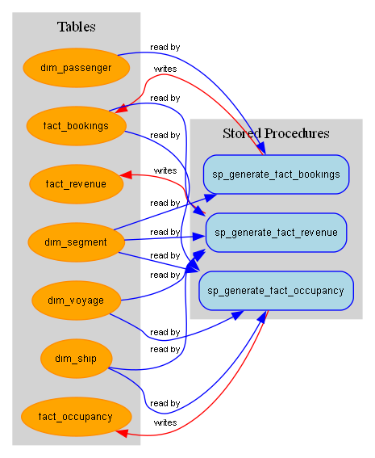

# SQL Reverse Engineering Toolkit

## Project Overview

This SQL Reverse Engineering Toolkit is a command-line application designed to analyze and visualize data lineage in a MySQL database. It extracts stored procedures and table schemas, parses them to identify dependencies (which procedures read from or write to which tables), and generates an interactive dependency graph. This tool is ideal for understanding complex database logic, refactoring legacy code, and documenting data workflows.

## Features

- **Database Extraction:** Extracts `CREATE TABLE` statements and stored procedure definitions from a MySQL database.
- **SQL Parsing:** Parses SQL code to identify read and write operations, establishing lineage between tables and procedures.
- **Graph Visualization:** Generates a `graphviz` diagram to visualize the data flow and dependencies.
- **Materialized Views:** Includes functionality to create and manage materialized views for data summarization.
- **Command-Line Interface:** Provides a simple CLI to run the extraction, parsing, and visualization steps individually or as a complete pipeline.

## Technologies Used

- **Python:** The core language for the application.
- **MySQL:** The target database for extraction and analysis.
- **mysql-connector-python:** For connecting to the MySQL database.
- **networkx:** For building the dependency graph.
- **graphviz:** For rendering the dependency graph.
- **python-dotenv:** For managing environment variables.

## For Recruiters (Best Practices)

This project demonstrates a commitment to software engineering best practices, including:

- **Modularity and Separation of Concerns:** The application is divided into distinct modules (`extractor`, `parser`, `graph_utils`, `materializer`), each with a specific responsibility. This makes the code easier to understand, maintain, and extend.
- **Clear and Well-Documented Code:** The code is written with clear, descriptive names and includes docstrings to explain the purpose of each module and function.
- **Configuration Management:** Database credentials and other settings are managed through environment variables (`.env` file), separating configuration from code and enhancing security.
- **Error Handling:** The code includes error handling to gracefully manage potential issues, such as database connection failures.
- **Command-Line Interface:** The use of `argparse` provides a user-friendly CLI, making the tool accessible and scriptable.

## Installation and Usage

1. **Clone the repository:**
   ```bash
   git clone <repository-url>
   cd <repository-directory>
   ```

2. **Create a virtual environment and install dependencies:**
   ```bash
   python -m venv venv
   source venv/bin/activate  # On Windows, use `venv\Scripts\activate`
   pip install -r requirements.txt
   ```

3. **Set up the environment variables:**
   Create a `.env` file in the project root and add your MySQL database connection details:
   ```
   DB_HOST=your_database_host
   DB_PORT=your_database_port
   DB_USER=your_database_user
   DB_PASSWORD=your_database_password
   DB_NAME=your_database_name
   ```

4. **Run the application:**
   The CLI provides three main commands: `extract`, `parse`, and `all`.

   - **Extract:** Dumps the database schema and stored procedures into the `outputs/sql_dumps` directory.
     ```bash
     python -m src.cli extract
     ```

   - **Parse:** Parses the SQL files and generates a `parsed_lineage.json` file and a `lineage_graph.png` in the `outputs` directory.
     ```bash
     python -m src.cli parse
     ```

   - **All:** Runs the entire pipeline (extract and parse).
     ```bash
     python -m src.cli all
     ```

## Database Example

The project is designed to work with a relational database schema. The example below is based on a cruise management system, with tables for passengers, voyages, bookings, and revenue.

**Dimension Tables:**
- `dim_passenger`: Stores passenger information.
- `dim_port`: Stores port details.
- `dim_ship`: Stores ship information.
- `dim_voyage`: Stores voyage details.
- `dim_segment`: Stores voyage segments (legs of a journey).
- `dim_cruise_companies`: Stores cruise company information.

**Fact Tables:**
- `fact_bookings`: Stores booking transactions.
- `fact_revenue`: Stores revenue data for each voyage.
- `fact_occupancy`: Stores occupancy rates for each voyage.

**Stored Procedures:**
The database includes stored procedures to populate the fact tables (e.g., `sp_generate_fact_bookings`).

## Output Example

After running the `parse` or `all` command, the tool will generate a dependency graph in `output_examples/lineage_graph.png`. This graph visually represents the relationships between the stored procedures and the tables they interact with.

Below is an example of the generated graph:



### JSON Output Example

The `parse` command also generates a `parsed_lineage.json` file, which contains a detailed breakdown of the relationships between procedures and tables.

```json
{
  "procedures": {
    "sp_generate_fact_bookings": {
      "reads": [
        "dim_passenger",
        "dim_segment"
      ],
      "writes": [
        "fact_bookings"
      ]
    },
    "sp_generate_fact_occupancy": {
      "reads": [
        "dim_segment",
        "dim_ship",
        "dim_voyage",
        "fact_bookings"
      ],
      "writes": [
        "fact_occupancy"
      ]
    },
    "sp_generate_fact_revenue": {
      "reads": [
        "dim_segment",
        "dim_ship",
        "dim_voyage",
        "fact_bookings"
      ],
      "writes": [
        "fact_revenue"
      ]
    }
  },
  "tables": {
    "dim_passenger": {
      "read_by": [
        "sp_generate_fact_bookings"
      ],
      "written_by": []
    },
    "dim_segment": {
      "read_by": [
        "sp_generate_fact_bookings",
        "sp_generate_fact_occupancy",
        "sp_generate_fact_revenue"
      ],
      "written_by": []
    },
    "fact_bookings": {
      "read_by": [
        "sp_generate_fact_occupancy",
        "sp_generate_fact_revenue"
      ],
      "written_by": [
        "sp_generate_fact_bookings"
      ]
    },
    "dim_ship": {
      "read_by": [
        "sp_generate_fact_occupancy",
        "sp_generate_fact_revenue"
      ],
      "written_by": []
    },
    "dim_voyage": {
      "read_by": [
        "sp_generate_fact_occupancy",
        "sp_generate_fact_revenue"
      ],
      "written_by": []
    },
    "fact_occupancy": {
      "read_by": [],
      "written_by": [
        "sp_generate_fact_occupancy"
      ]
    },
    "fact_revenue": {
      "read_by": [],
      "written_by": [
        "sp_generate_fact_revenue"
      ]
    }
  }
}
```

### SQL Procedure Example

Here is an example of a stored procedure that the tool can parse:

```sql
CREATE DEFINER=`windows_user`@`%` PROCEDURE `sp_generate_fact_bookings`()
BEGIN
  TRUNCATE TABLE fact_bookings;
  INSERT INTO fact_bookings (passenger_id, segment_id, booking_date, price)
  SELECT p.passenger_id, s.segment_id, CURDATE(), 100 + FLOOR(RAND()*900)
  FROM dim_passenger p
  JOIN dim_segment s ON 1=1
  WHERE RAND() < 0.15;
END
```

